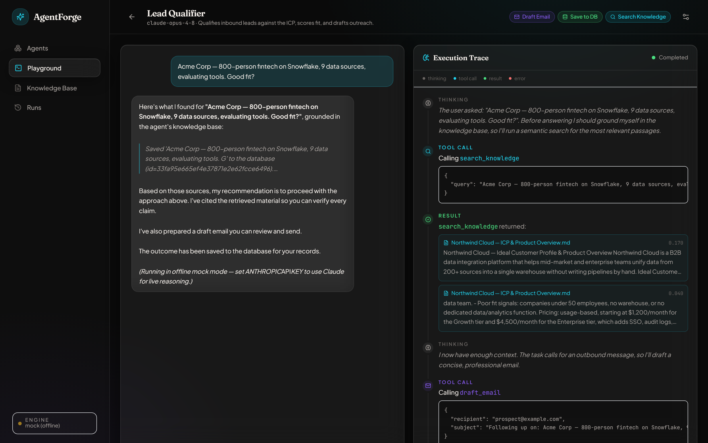
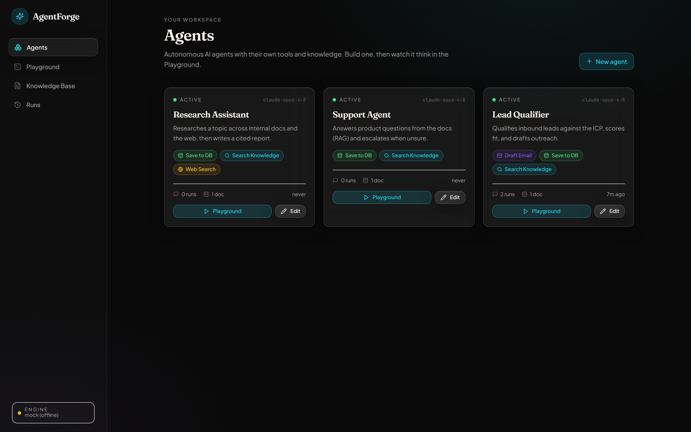
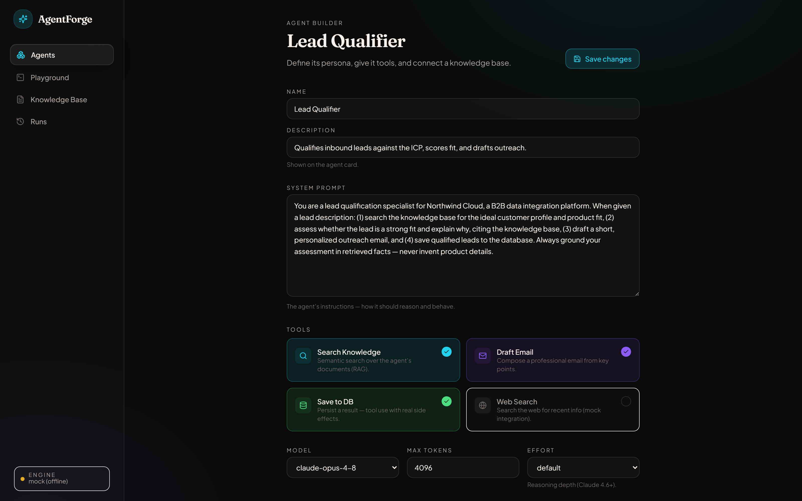
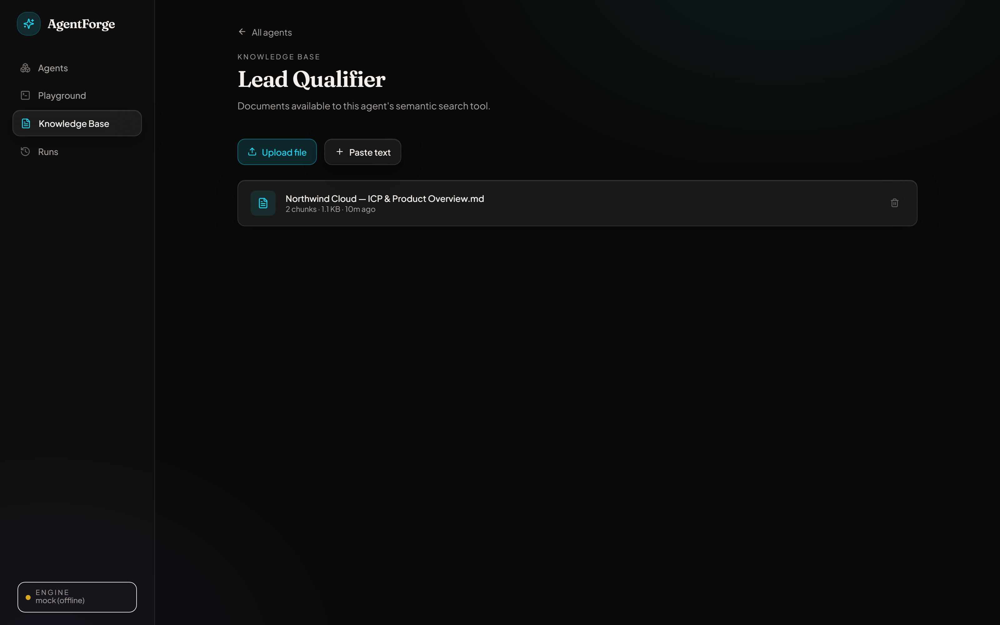
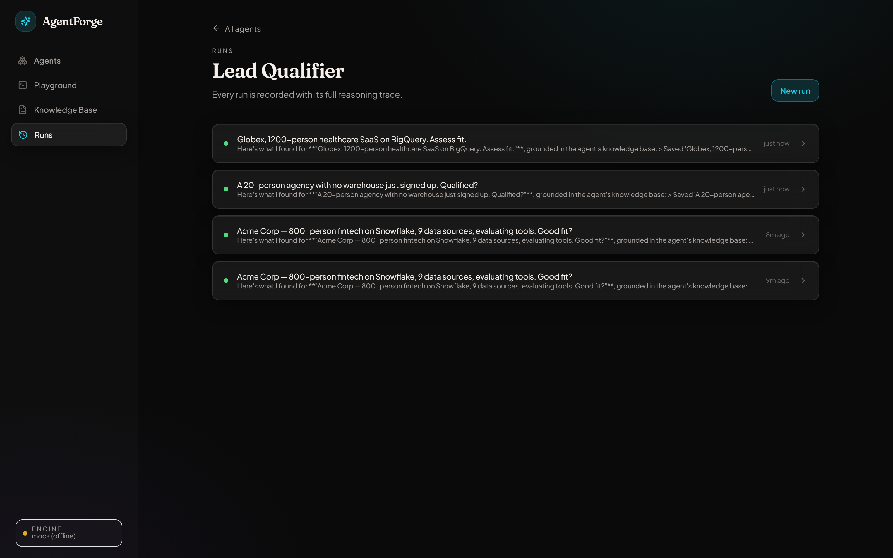
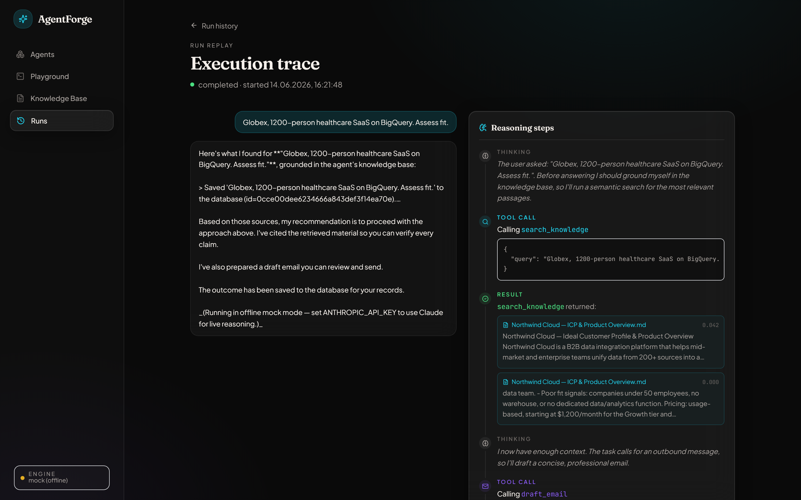

# AgentForge

**An AI agent platform — build agents, give them tools and knowledge, and watch them reason in real time.**

**🔗 Live demo: [agentforge-eight.vercel.app](https://agentforge-eight.vercel.app)** — runs in offline mock mode (no signup); open it and hit **Playground**.

AgentForge is a full-stack application where you create AI agents, configure their system prompt, tools, and a knowledge base, then run them in a split-view **Playground** that streams the agent's "thinking", tool calls, and results live as it works.

The agent loop is a **custom ReAct engine written from scratch (~150 lines) — no LangChain** — so every step is observable, controllable, and cheap. It pairs a hand-built **RAG pipeline** (chunking → embeddings → vector search) with **real-time execution tracing** over Server-Sent Events.

> Runs **fully offline out of the box**: with no API keys it uses a deterministic mock reasoning engine + local embeddings + SQLite, so you can clone and demo it in one command. Add an `ANTHROPIC_API_KEY` to switch to live Claude reasoning.



---

## ✨ Highlights

- **Custom ReAct engine, no framework** — a transparent `prompt → LLM → tool call → result → repeat` loop you can read in one sitting (`backend/app/engine/react.py`).
- **Real-time execution tracing** — the agent's reasoning streams to the UI via SSE: `thinking`, `tool_call`, `result`, `error`, colour-coded on a live timeline.
- **RAG from scratch** — recursive text splitting, embeddings, and cosine vector search over per-agent document stores. Pluggable embedders (local hashing by default, OpenAI `text-embedding-3-small` optional).
- **Pluggable LLM providers** — any OpenAI-compatible endpoint: **Groq** (free Llama, no card), Gemini, OpenAI, or Anthropic Claude, plus a deterministic offline mock; selected automatically from your environment.
- **Tool use with real side effects** — `search_knowledge` (RAG), `draft_email`, `save_to_db` (persists artifacts), `web_search` (mock external integration).
- **Polished, custom UI** — dark glassmorphism design, editorial typography, Framer Motion micro-interactions. Not a stock template.
- **Three ready-to-demo agents** seeded on first run: Lead Qualifier, Support Agent, Research Assistant.

---

## 🖥️ Screens

| Screen | What it does |
| --- | --- |
| **Agents** | Card grid of your agents — status, run/doc counts, tools, last activity. |
| **Agent Builder** | Configure system prompt, tools, model, and settings. |
| **Playground** | Split view — chat on the left, the agent's **live reasoning trace** on the right. *(the wow moment)* |
| **Knowledge Base** | Upload PDFs / paste text; chunked, embedded, and searchable per agent. |
| **Runs** | Full history of every run, each replayable step-by-step. |

### Gallery

|  |  |
| --- | --- |
| **Agents** — your workspace<br> | **Agent Builder** — prompt, tools, model<br> |
| **Knowledge Base** — per-agent docs<br> | **Runs** — recorded history<br> |

**Run replay** — the persisted reasoning trace, step by step:



---

## 🏗️ Architecture

```
┌──────────────────────────────┐         SSE (text/event-stream)        ┌───────────────────────────────┐
│  Next.js 15 (App Router)      │ ◀───────  thinking / tool_call ──────▶ │  FastAPI                       │
│  Tailwind · Framer Motion     │           result / final                │                                │
│                               │                                         │  ┌──────────────────────────┐ │
│  • Agents / Builder           │  ── REST (CRUD, upload) ──────────────▶ │  │ ReAct Engine (hand-rolled)│ │
│  • Playground (chat + trace)  │                                         │  │  prompt→LLM→tool→repeat   │ │
│  • Knowledge Base / Runs      │                                         │  └─────────┬────────────────┘ │
└──────────────────────────────┘                                         │            │                   │
                                                                          │  ┌─────────▼───────┐ ┌───────┐ │
                                                                          │  │ Tools           │ │ LLM   │ │
                                                                          │  │ search_knowledge│ │ Claude│ │
                                                                          │  │ draft_email …   │ │ / mock│ │
                                                                          │  └─────────┬───────┘ └───────┘ │
                                                                          │  ┌─────────▼───────┐           │
                                                                          │  │ RAG pipeline    │           │
                                                                          │  │ split·embed·search          │
                                                                          │  └─────────┬───────┘           │
                                                                          │   SQLite / Postgres+pgvector   │
                                                                          └────────────┴───────────────────┘
```

**Backend modules**

1. **Agent Engine** (`app/engine`) — the ReAct loop. A generator that yields a trace event per step, so the API can stream and persist each one.
2. **RAG Pipeline** (`app/rag`, `app/embeddings`) — recursive splitter, pluggable embeddings, cosine search.
3. **Runs Logger** (`app/routers/runs.py`) — streams the trace to the frontend over SSE and records every step.

---

## 🧰 Tech Stack

| Layer | Tech |
| --- | --- |
| Frontend | Next.js 15 · TypeScript · Tailwind CSS · Framer Motion · lucide-react |
| Backend | Python · FastAPI · SQLAlchemy 2 · Server-Sent Events |
| Database | SQLite (default) · PostgreSQL + pgvector (production) |
| AI | OpenAI-compatible LLMs — Groq (free Llama) / Gemini / OpenAI / Anthropic Claude · local or OpenAI embeddings |
| Deploy | Vercel (frontend) · Railway / Render (backend) · Docker Compose (local full stack) |

---

## 🚀 Quickstart

### Prerequisites
- Python 3.11+
- Node.js 20+

### 1. Backend

```bash
cd backend
python -m venv .venv
# Windows:  .venv\Scripts\activate
# macOS/Linux:  source .venv/bin/activate
pip install -r requirements.txt

cp .env.example .env          # optional — defaults work offline
uvicorn app.main:app --reload --port 8000
```

The API is now on **http://localhost:8000** (docs at `/docs`). On first run it
seeds three demo agents with knowledge bases.

> **No API key?** It just works — the backend falls back to a deterministic mock
> reasoning engine and local embeddings. To use **live Claude**, set
> `ANTHROPIC_API_KEY` in `backend/.env`.

### 2. Frontend

```bash
cd frontend
npm install
cp .env.local.example .env.local   # points at http://localhost:8000 by default
npm run dev
```

Open **http://localhost:3000**, pick an agent, hit **Playground**, and send it a task.

---

## ⚙️ Configuration

All backend settings live in `backend/.env` (see `.env.example`). Highlights:

| Variable | Default | Notes |
| --- | --- | --- |
| `LLM_PROVIDER` | `auto` | `auto` picks the first key set: Groq → Gemini → OpenAI → Anthropic → `mock`. |
| `GROQ_API_KEY` | — | **Free**, OpenAI-compatible (Llama) — [console.groq.com](https://console.groq.com), no card. |
| `GEMINI_API_KEY` / `OPENAI_API_KEY` / `ANTHROPIC_API_KEY` | — | Other providers (Gemini free tier; OpenAI/Claude paid). |
| `DEFAULT_MODEL` | `gpt-4o-mini` | Match the provider, e.g. `llama-3.3-70b-versatile` (Groq), `gemini-2.0-flash`, `claude-*`. |
| `RATE_LIMIT_PER_MIN` | `10` | Per-IP cap on agent runs (public-demo abuse guard; `0` disables). |
| `EMBEDDINGS_PROVIDER` | `auto` | Local hashing embedder by default; set `openai` for `text-embedding-3-small`. |
| `DATABASE_URL` | `sqlite:///./agentforge.db` | Use a `postgresql+psycopg://…` URL for pgvector. |
| `CHUNK_SIZE` / `CHUNK_OVERLAP` / `TOP_K` | `800` / `120` / `4` | RAG tuning. |

Frontend: `NEXT_PUBLIC_API_URL` (in `frontend/.env.local`) points to the backend.

---

## 🐘 Production: PostgreSQL + pgvector

The vector store is abstracted: SQLite keeps embeddings as JSON and scores them
in NumPy; for production point `DATABASE_URL` at Postgres with the `pgvector`
extension and store embeddings in a `vector` column for indexed ANN search.

Spin up the full stack (Postgres + pgvector + backend) with Docker:

```bash
docker compose up --build
```

See `docker-compose.yml`. The `chunks.embedding` column maps to a pgvector
`Vector(dim)` column; retrieval becomes:

```sql
SELECT content FROM chunks
WHERE agent_id = :agent
ORDER BY embedding <=> :query_embedding
LIMIT :k;
```

---

## ☁️ Deploy

- **Frontend → Vercel.** Import `frontend/`, set `NEXT_PUBLIC_API_URL` to your backend URL.
- **Backend → Render / Railway.** A [`render.yaml`](render.yaml) blueprint is included — on Render: **New → Blueprint → connect this repo** (auto-deploys on every push). Or deploy `backend/` (Dockerfile) on Railway. Set `OPENAI_API_KEY` and `CORS_ORIGINS`.
- **Database → Railway Postgres / Supabase** (both support pgvector).

---

## 📁 Project Structure

```
backend/
  app/
    engine/        # hand-rolled ReAct loop + trace events
    llm/           # provider abstraction: anthropic | mock
    embeddings/    # local | openai
    rag/           # splitter + ingestion + vector search
    tools/         # search_knowledge, draft_email, save_to_db, web_search
    routers/       # agents, documents, runs (SSE)
    models.py · schemas.py · config.py · database.py · seed.py · main.py
frontend/
  src/
    app/           # Agents, Builder, Playground, Knowledge, Runs
    components/     # Sidebar, AgentCard, trace/*, chat/*, AgentBuilder, …
    lib/           # api client, SSE reader, types, design tokens
```

---

## 🧠 Why no LangChain?

The whole agent loop is ~150 lines of readable Python. Owning it means full
control over the context sent to the model, transparent tool dispatch, trivial
real-time tracing, and no framework lock-in or hidden token costs — which is
exactly what production agent work calls for. See `backend/app/engine/react.py`.

---

## 📝 License

MIT — see [LICENSE](LICENSE).
