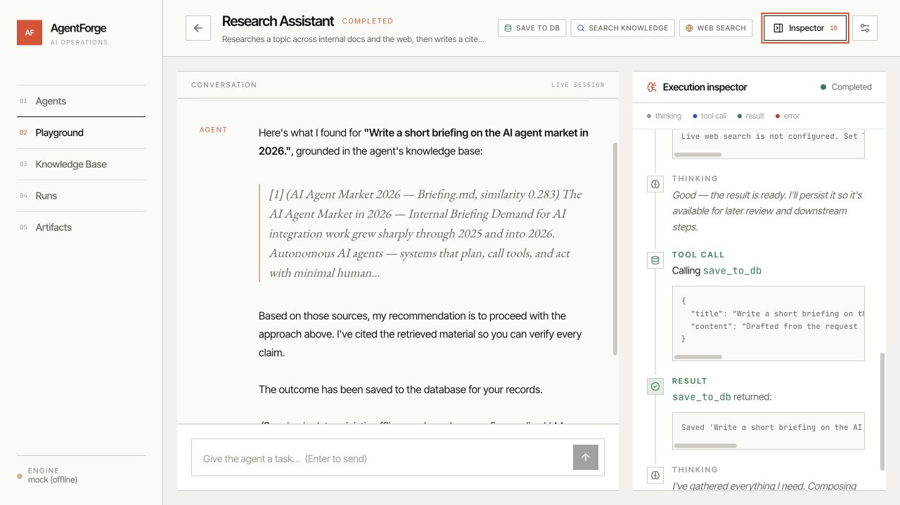
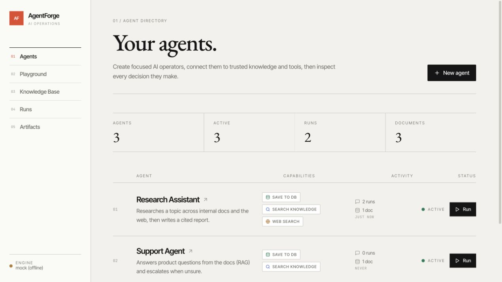
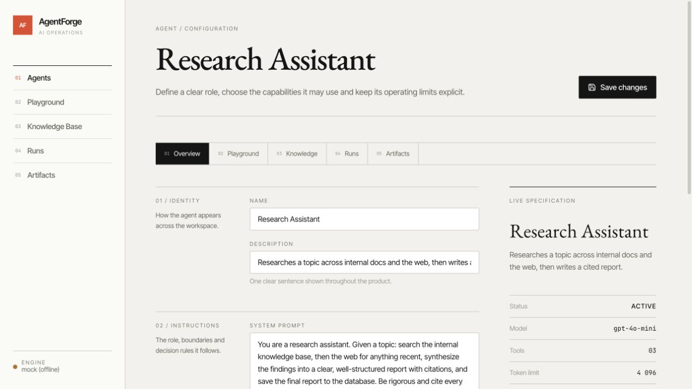
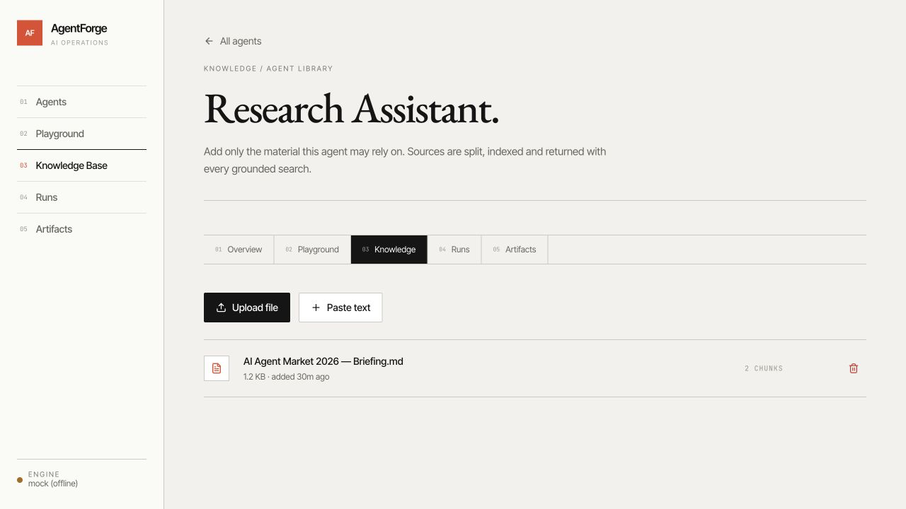
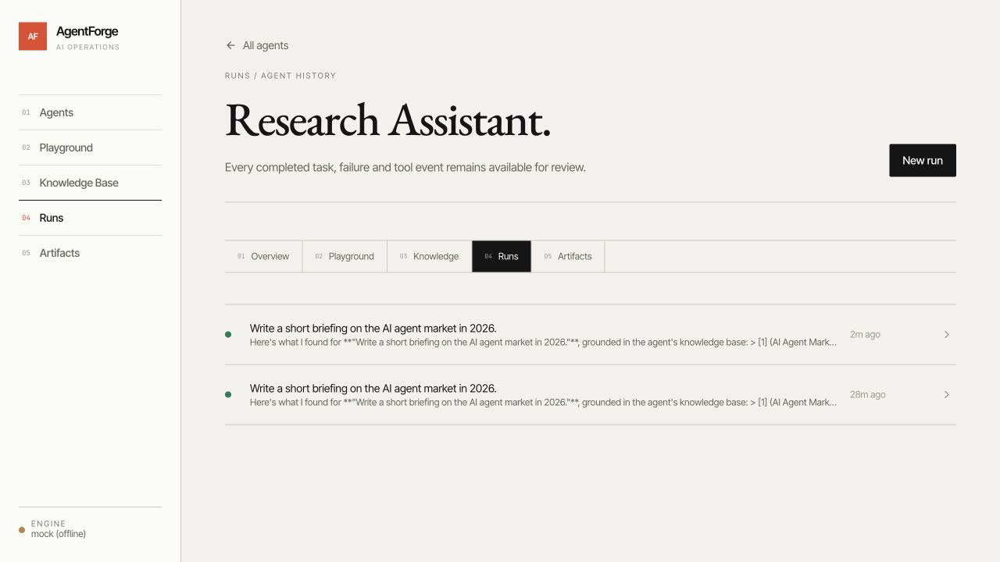
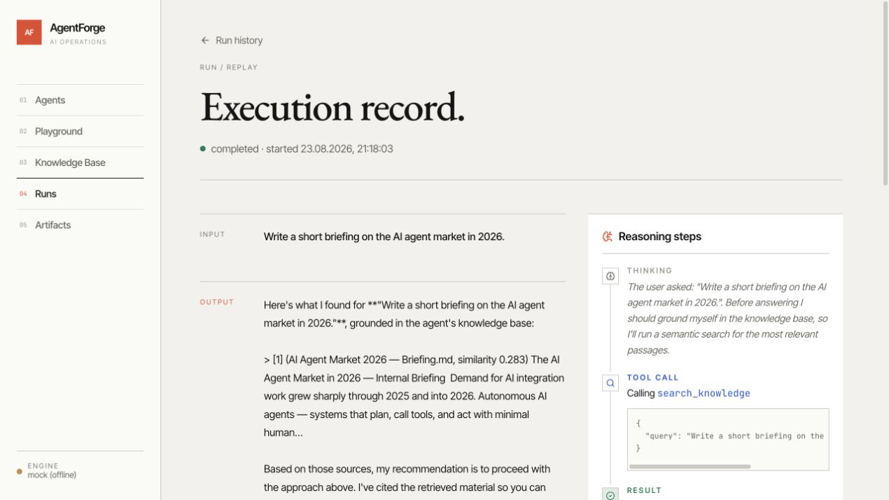
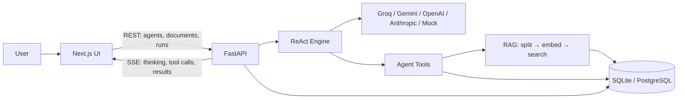

# AgentForge

**An AI agent platform — build agents, give them tools and knowledge, and watch them reason in real time.**

**🔗 Live demo: [agentforge-eight.vercel.app](https://agentforge-eight.vercel.app)** — real agents on **GPT-OSS 120B** via Groq, no signup; open it and hit **Playground**. The backend sleeps on Render's free tier, so the first request may take ~30–60s to wake.

AgentForge is a full-stack application where you create AI agents, configure their system prompt, tools, and a knowledge base, then run them in a split-view **Playground** that streams the agent's "thinking", tool calls, and results live as it works.

The agent loop is a **custom ReAct engine written from scratch (~150 lines) — no LangChain** — so every step is observable, controllable, and cheap. It pairs a hand-built **RAG pipeline** (chunking → embeddings → vector search) with **real-time execution tracing** over Server-Sent Events.

> Runs **fully offline out of the box**: with no API keys it uses a deterministic mock reasoning engine + local embeddings + SQLite, so you can clone and demo it in one command. Add a `GROQ_API_KEY` ([console.groq.com](https://console.groq.com)) to switch to live GPT-OSS 120B reasoning, the same setup the live demo runs. Gemini, OpenAI, and Anthropic Claude work too — the provider is auto-selected from whichever keys you set, in the order Groq → Gemini → OpenAI → Anthropic. External web search is disabled honestly until `TAVILY_API_KEY` is configured; offline mode never fabricates sources.



---

## ✨ Highlights

- **Custom ReAct engine, no framework** — a transparent `prompt → LLM → tool call → result → repeat` loop you can read in one sitting (`backend/app/engine/react.py`).
- **Real-time execution tracing** — the agent's reasoning streams to the UI via SSE: `thinking`, `tool_call`, `result`, `error`, colour-coded on a live timeline.
- **RAG from scratch** — recursive text splitting, embeddings, and cosine vector search over per-agent document stores. Pluggable embedders (local hashing by default, OpenAI `text-embedding-3-small` optional).
- **Pluggable LLM providers** — Groq, Gemini, and OpenAI through their OpenAI-compatible endpoints, plus native Anthropic Claude and a deterministic offline mock; selected automatically from your environment.
- **Tool use with real side effects** — `search_knowledge` (RAG), `draft_email`, `save_to_db` (persists artifacts), and live `web_search` through Tavily when configured.
- **In-session conversation context** — the Playground sends up to 20 recent user/assistant turns so follow-up questions keep their context without unbounded prompts.
- **Polished, custom UI** — a light business SaaS system shaped by Swiss design: disciplined grids, working whitespace, warm paper surfaces, precise hairlines, restrained red accents, Inter Tight + EB Garamond, and purposeful Framer Motion micro-interactions. Not a stock template.
- **Three ready-to-demo agents** seeded on first run: Lead Qualifier, Support Agent, Research Assistant.

---

## 🖥️ Screens

| Screen | What it does |
| --- | --- |
| **Agents** | Structured agent directory — status, run/doc counts, tools, and last activity. |
| **Agent Builder** | Configure system prompt, tools, model, and settings. |
| **Playground** | Split view — chat on the left, the agent's **live reasoning trace** on the right. *(the wow moment)* |
| **Knowledge Base** | Upload PDFs / paste text; chunked, embedded, and searchable per agent. |
| **Runs** | Full history of every run, each replayable step-by-step. |
| **Artifacts** | Persistent records, reports, and notes created by agent tools, linked back to their source run. |

### Gallery

|  |  |
| --- | --- |
| **Agents** — your workspace<br> | **Agent Builder** — prompt, tools, model<br> |
| **Knowledge Base** — per-agent docs<br> | **Runs** — recorded history<br> |

**Run replay** — the persisted reasoning trace, step by step:



---

## 🏗️ Architecture


```mermaid
flowchart LR
    U["User"] --> F["Next.js UI"]
    F -->|"REST: agents, documents, runs"| API["FastAPI"]
    API -->|"SSE: thinking, tool calls, results"| F
    API --> E["ReAct Engine"]
    E --> L["Groq / Gemini / OpenAI / Anthropic / Mock"]
    E --> T["Agent Tools"]
    T --> R["RAG: split → embed → search"]
    R --> DB[("SQLite / PostgreSQL")]
    T --> DB
    API --> DB
```

**Backend modules**

1. **Agent Engine** (`app/engine`) — the ReAct loop. A generator that yields a trace event per step, so the API can stream and persist each one.
2. **RAG Pipeline** (`app/rag`, `app/embeddings`) — recursive splitter, pluggable embeddings, cosine search.
3. **Runs Logger** (`app/routers/runs.py`) — streams the trace to the frontend over SSE and records every step.

---

## 🧰 Tech Stack

| Layer | Tech |
| --- | --- |
| Frontend | Next.js 16 · React 19 · TypeScript · Tailwind CSS · Framer Motion · lucide-react |
| Backend | Python · FastAPI · SQLAlchemy 2 · Server-Sent Events |
| Database | SQLite (default) · PostgreSQL + pgvector (production) |
| AI | Groq / Gemini / OpenAI-compatible chat completions · native Anthropic Claude · local or OpenAI embeddings |
| Deploy | Vercel (frontend) · Render (backend, `render.yaml`) · Docker Compose (local full stack) |

---

## 🚀 Quickstart

### Prerequisites
- Python 3.12+
- Node.js 20.9+

### 1. Backend

```bash
cd backend
python -m venv .venv
# Windows:  .venv\Scripts\activate
# macOS/Linux:  source .venv/bin/activate
pip install -r requirements.txt

cp .env.example .env          # optional — defaults work offline
uvicorn app.main:app --reload --port 8000
```

The API is now on **http://localhost:8000** (docs at `/docs`). On first run it
applies the Alembic migrations and seeds three demo agents with knowledge bases.

> **No API key?** It just works — the backend falls back to a deterministic mock
> reasoning engine and local embeddings. To run on a real LLM, set a
> `GROQ_API_KEY` in `backend/.env` ([console.groq.com](https://console.groq.com));
> the bundled `DEFAULT_MODEL=openai/gpt-oss-120b` works as-is.
> `GEMINI_API_KEY`, `OPENAI_API_KEY`, and `ANTHROPIC_API_KEY` also work — with
> `LLM_PROVIDER=auto` the first key set wins, in the order
> Groq → Gemini → OpenAI → Anthropic → mock. Provider adapters safely replace a
> stale model from another provider with their own default.

### 2. Frontend

```bash
cd frontend
npm install
cp .env.local.example .env.local   # points at http://localhost:8000 by default
npm run dev
```

Open **http://localhost:3000**, pick an agent, hit **Playground**, and send it a task.

### 3. Tests

```bash
cd backend
pip install -r requirements-dev.txt
pytest -q

cd ../frontend
npm run lint
npm run typecheck
npm run build
```

---

## ⚙️ Configuration

All backend settings live in `backend/.env` (see `.env.example`). Highlights:

| Variable | Default | Notes |
| --- | --- | --- |
| `LLM_PROVIDER` | `auto` | `auto` picks the first key set: Groq → Gemini → OpenAI → Anthropic → `mock`. |
| `GROQ_API_KEY` | — | OpenAI-compatible Groq API — [console.groq.com](https://console.groq.com). |
| `GEMINI_API_KEY` / `OPENAI_API_KEY` / `ANTHROPIC_API_KEY` | — | Other providers (Gemini free tier; OpenAI/Claude paid). |
| `TAVILY_API_KEY` | — | Enables real external sources for `web_search`; without it the tool returns no sources and says why. |
| `DEFAULT_MODEL` | `openai/gpt-oss-120b` (in `.env.example`) | Match the provider, e.g. `gemini-2.0-flash`, `gpt-4o-mini`, or `claude-*`; provider adapters fall back safely when a saved agent uses another provider's model. |
| `RATE_LIMIT_PER_MIN` | `10` | Per-IP cap on agent runs (public-demo abuse guard; `0` disables). |
| `WRITE_LIMIT_PER_MIN` | `20` | Per-IP cap on create/update/delete + uploads (`0` disables). |
| `EMBEDDINGS_PROVIDER` | `auto` | Local hashing embedder by default; set `openai` for `text-embedding-3-small`. |
| `DATABASE_URL` | `sqlite:///./agentforge.db` | Use a `postgresql+psycopg://…` URL for pgvector. |
| `CHUNK_SIZE` / `CHUNK_OVERLAP` / `TOP_K` | `800` / `120` / `4` | RAG tuning. |
| `API_AUTH_TOKEN` | — | Optional Bearer-token guard for every data-bearing API route. The frontend prompts for it at runtime. |

Frontend: `NEXT_PUBLIC_API_URL` (in `frontend/.env.local`) points to the backend.

---

## 🐘 Production: PostgreSQL + pgvector

The vector store is abstracted: SQLite keeps embeddings as JSON and scores them
in NumPy; PostgreSQL stores them in a native `vector(EMBEDDING_DIM)` column and
runs cosine search in the database through an HNSW index. Alembic creates the
extension, migrates the column, and preserves legacy SQLite demo databases.

Spin up the full stack (Postgres + pgvector + backend) with Docker:

```bash
docker compose up --build
```

See `docker-compose.yml`. The `chunks.embedding` column maps to a pgvector
`Vector(dim)` column; retrieval becomes:

```sql
SELECT content FROM chunks
WHERE agent_id = :agent
ORDER BY embedding <=> :query_embedding
LIMIT :k;
```

Keep one embedding dimension per database. `text-embedding-3-small` is requested
with `EMBEDDING_DIM` dimensions so local and OpenAI embeddings share the same
schema. Re-ingest documents after changing the embedding provider or dimension.

### Protecting a deployment

Set a strong `API_AUTH_TOKEN` on any private or client-facing deployment. The
frontend detects that protection through the public health endpoint, prompts for
the token, validates it, and stores it only in that browser tab's session storage.
This is a practical single-tenant guard; a multi-user SaaS still needs real
identity, roles, and tenant isolation.

---

## ☁️ Deploy

- **Frontend → Vercel.** Import `frontend/`, set `NEXT_PUBLIC_API_URL` to your backend URL.
- **Backend → Render (free).** A [`render.yaml`](render.yaml) blueprint is included — **New → Blueprint → connect this repo**. Render prompts for `GROQ_API_KEY`, `TAVILY_API_KEY`, and `API_AUTH_TOKEN`, then auto-deploys on every push. (Any Docker host works: `backend/` ships a Dockerfile.)
- **Database → Neon / Supabase** (both free, both support pgvector). Set `DATABASE_URL` on the backend; without it the app uses SQLite, which Render's free tier wipes on every restart. Avoid Render's *own* free Postgres — it expires 30 days after creation and is then deleted.

---

## 📁 Project Structure

```
backend/
  app/
    engine/        # hand-rolled ReAct loop + trace events
    llm/           # provider abstraction: openai-compatible (groq|gemini|openai) | anthropic | mock
    embeddings/    # local | openai
    rag/           # splitter + ingestion + vector search
    tools/         # search_knowledge, draft_email, save_to_db, web_search
    routers/       # agents, documents, runs (SSE)
    models.py · schemas.py · config.py · database.py · seed.py · main.py
  migrations/      # Alembic schema history (SQLite and PostgreSQL/pgvector)
  tests/           # auth, ReAct/SSE, source-integrity, cascade regressions
frontend/
  src/
    app/           # Agents, Builder, Playground, Knowledge, Runs, Artifacts
    components/     # Sidebar, AgentCard, trace/*, chat/*, AgentBuilder, …
    lib/           # api client, SSE reader, tool metadata, types, helpers
```

---

## 🧠 Why no LangChain?

The whole agent loop is ~150 lines of readable Python. Owning it means full
control over the context sent to the model, transparent tool dispatch, trivial
real-time tracing, and no framework lock-in or hidden token costs — which is
exactly what production agent work calls for. See `backend/app/engine/react.py`.

---

## 📝 License

MIT — see [LICENSE](LICENSE).
